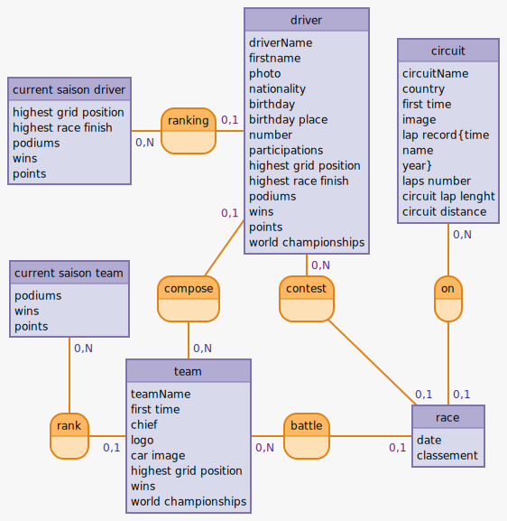

team: teamName, first time, chief, logo, car image, highest grid position, wins, world championships
compose, 0N team, 01 driver
circuit: circuitName, country, first time, image, lap record{time, name, year}, laps number, circuit lap lenght, circuit distance

rank, 01 team, 0N current saison team
driver: driverName, firstname, photo, nationality, birthday, birthday place, number, participations, highest grid position, highest race finish, podiums, wins, points, world championships
contest, 0N circuit, 0N driver: date, classement

current saison team: podiums, wins, points
ranking, 01 driver, 0N current saison driver
current saison driver: highest grid position, highest race finish, podiums, wins, points

# MCD

current saison driver: _highest grid position, highest race finish, podiums, wins, points
ranking, 01 driver, 0N current saison driver
driver: _driverName, firstname, photo, nationality, birthday, birthday place, number, participations, highest grid position, highest race finish, podiums, wins, points, world championships
circuit: _circuitName, country, first time, image, lap record{time, name, year}, laps number, circuit lap lenght, circuit distance

current saison team: _podiums, wins, points
compose, 01 driver, 0N team
contest, 0N driver, 01 race
on, 0N circuit, 01 race

rank, 01 team, 0N current saison team
team: _teamName, first time, chief, logo, car image, highest grid position, wins, world championships
battle, 0N team, 01 race
race: _date, classement

# MLD

current saison driver ( highest grid position, highest race finish, podiums, wins, points )

driver ( driverName, firstname, photo, nationality, birthday, birthday place, number, participations, highest grid position, highest race finish, podiums, wins, points, world championships, currentSaisonDriverId, teamId )

circuit ( circuitName, country, first time, image, lap record{time, name, year}, laps number, circuit lap lenght, circuit distance )

current saison team ( podiums, wins, points )

team ( teamName, first time, chief, logo, car image, highest grid position, wins, world championships, currentSaisonTeamID )

race ( date, classement, circuitId, driverId, teamId )